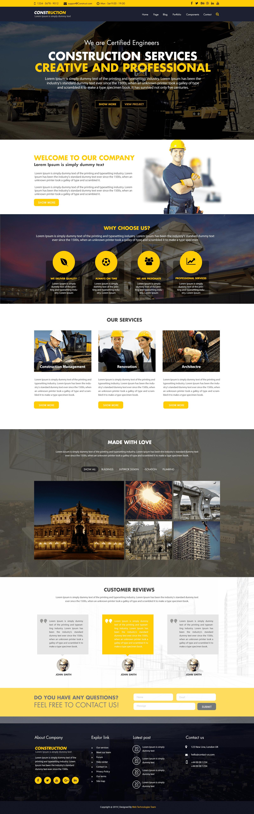

# Construction Company Website-Template
> A simple website template with some interesting features created with HTML , CSS and JavaScript for learning purposes and to practice (Advanced DOM and Events) with JavaScript.

## Table of Contents
* [General Info](#general-information)
* [Technologies Used](#technologies-used)
* [Features](#features)
* [Screenshots](#screenshots)
* [Setup](#setup)
* [Usage](#usage)
* [Project Status](#project-status)
* [Room for Improvement](#room-for-improvement)
* [Acknowledgements](#acknowledgements)
* [Contact](#contact)
* [License](#license)

## General Information
- Provide general information about your project here.
- What problem does it (intend to) solve?
- What is the purpose of your project?
- Why did you undertake it?
<!-- You don't have to answer all the questions - just the ones relevant to your project. -->

## Technologies Used
- Tech 1 - version 1.0
- Tech 2 - version 2.0
- Tech 3 - version 3.0

## Features
List the ready features here:
- Awesome feature 1
- Awesome feature 2
- Awesome feature 3

## Screenshots

<!-- If you have screenshots you'd like to share, include them here. -->

## Acknowledgements
- Images borrowed from [@Orion56]
- This project was made as a final Task for cvbconstruct ltd.
- Many thanks to Architect. Shahjahan Ravjee

## Contact
Maintained by [@keepleritlimited](https://github.com/keepleritlimited) - feel free to contact me!

## License
This project is open source and available under the [... License]().

<!-- You don't have to include all sections - just the one's relevant to your project -->
